# 🤖 AI Chatbot: Full-Stack RAG (Retrieval-Augmented Generation) System

AI Chatbot is an enterprise-grade, high-performance RAG application designed to ingest multi-source documents (Files, Web URLs, and Audio recordings), process them through a local embedding and NLP pipeline, persist vectors in PostgreSQL, and offer real-time chat grounding using Google Gemini streaming LLM.

By transitioning from cloud-based embeddings to local, quantized models via `@xenova/transformers`, this application achieves an **~85% reduction in Gemini API dependency, 100x faster embedding speeds, and zero-cost local ingestion**.

---

## 🌟 Key Features

### 1. Multi-Source Document Ingestion
* **Document Uploads**: Direct support for `PDF`, `DOCX`, `TXT`, `CSV`, and `XLSX` files up to **25MB**.
* **Web URL Ingestion**: Ingests and cleans any public web page, converting raw HTML into readable content before parsing and chunking.
* **Audio Uploads (.mp3, .wav, .m4a)**: Support for files up to **500MB** and **2 hours** in length.
  * *Automated Chunking*: Smartly splits large audio files (>18MB) into 10-minute WAV fragments using `ffmpeg` to prevent payload failures.
  * *Speaker & Language Inference*: Employs Gemini's native audio understanding to transcribe conversations with automatic speaker formatting (`Speaker 1:`, `Speaker 2:`) and estimates speaker counts.

### 2. High-Performance Local NLP & Embedding Engine
* **Quantized Embeddings**: Generates dense 384-dimensional vectors locally using `Xenova/all-MiniLM-L6-v2` running on CPU via ONNX Runtime.
* **In-Memory Caching**: Implements MD5 query hashing and cache storage (`node-cache`) to yield `<1ms` lookup speeds for repeated vector requests.
* **Parallel Batch Ingestion**: Processes large document segments in parallel batch slices of 32 chunks.
* **Local Language Detection**: Identifies transcription languages locally using `Xenova/lang-detection-fasttext-legacy`, mapping language tags (e.g., `en`, `hi`, `fr`) to clear naming headers.
* **Deterministic NLP Helpers**: Query expansion (generating 3 search variants) and conversation title generation are handled instantly on the local node thread.

### 3. Dual Storage Architecture
* **Vector Database**: Neon PostgreSQL equipped with `pgvector` and an HNSW index using `vector_cosine_ops` for fast similarity searches.
* **Persistent File Storage**: Secure document backup in Azure Blob Storage. Temp folders (`backend/uploads/`) manage file ingestion buffers.

### 4. Grounded Conversational UX
* **Chat Document Scoping**: Start conversations scoped to **All Documents** or restrict grounding to **specifically selected documents**.
* **Real-time Streaming**: Connects through Server-Sent Events (SSE) for low-latency answer generation.
* **Citations & Fallbacks**: Displays the retrieved text excerpts and source documents beneath messages, falling back to hybrid full-text indexing if vector searches lack similarity.

---

## 🏗️ Architecture & Project Flow

```mermaid
flowchart TD
    subgraph Ingestion["1. INGESTION PIPELINE"]
        A[File Upload / Web URL / Audio] --> B[Validator]
        B -->|Audio Files| C[ffmpeg Splitter]
        B -->|Web URL| D[Web Scraper & JSDOM]
        B -->|Standard Docs| E[Document Parsers]
        
        C -->|Segment Chunks| F[Gemini transcription API]
        F --> G[Local Lang Classifier]
        D --> H[Raw Text]
        E --> H
        G --> H
        
        H --> I[Semantic Chunker]
        I --> J[Local Xenova Embedder all-MiniLM-L6-v2]
        J -->|384-dim Vectors| K[(Neon DB: pgvector + HNSW)]
        A -->|Archive Backup| L[(Azure Blob Storage)]
    end

    subgraph Query["2. CHAT & RETRIEVAL FLOW"]
        M[User Query] --> N[Local Query Expansion]
        N -->|3 Search Variants| O[Local Embedding Generator]
        O --> P[(Neon Vector Search)]
        P -->|Excerpts| Q[Hybrid full-text Fallback]
        Q --> R[Reranker & Deduplicator]
        R --> S[Context Builder]
        S --> T[Gemini streamResponse API]
        T -->|Server-Sent Events| U[React frontend UI]
    end
```



### In-Depth Workflow

#### A. Ingestion Flow
1. **Parsing**: When a document or URL is processed, the backend reads raw content into formatted strings. For audio files, a memory partition uploads base64 strings directly, or splits large audio using `fluent-ffmpeg` to transcribe chunks sequentially via `gemini-flash-latest`.
2. **Chunking**: Text is segmented into 500-1000 character chunks with a sliding window overlay.
3. **Local Embedding**: The chunk arrays are passed to `localEmbedder.js` which loads `all-MiniLM-L6-v2`. Computations run in batches, transforming text into `384` element coordinate arrays.
4. **Database Insertion**: Arrays are saved to the `document_chunks` table as a `vector(384)` alongside metadata links (document ID, text preview, chunk index).
5. **Azure Blob Backup**: The raw file is backed up asynchronously in Azure.

#### B. Retrieval & Q&A Flow
1. **Query Expansion**: The system expands a user's question locally to strip filler words and produce query variations.
2. **Similarity Search**: Each query variation is embedded locally. The vectors are matched against Neon PostgreSQL table indexes using cosine distance (`<=>` operator).
3. **Consolidation**: Excerpts are de-duplicated, reranked by text overlaps, and capped at `MAX_CONTEXT_CHARS` to control payload sizes.
4. **Prompt Grounding**: The formatted context, matching citation cards, and recent conversation history are compiled.
5. **Gemini Streaming**: The prompt is processed by `gemini-flash-latest`, and responses are flushed segment-by-segment to the user interface.

---

## ⚙️ RAG Pipeline Workflow

The RAG (Retrieval-Augmented Generation) pipeline consists of two distinct lifecycle workflows: **Document Ingestion** (parsing and loading data into the vector index) and **Query Retrieval** (grounding chat interactions with contextual documents).

### 1. Document Ingestion Lifecycle
```text
[Raw Input] ➔ [Format Ingestion] ➔ [Chunk & Token Capping] ➔ [Xenova Vectorizer] ➔ [Postgres pgvector & Azure Storage]
```
* **Step 1: Document Upload & Source Detection**
  * The user uploads a file, enters a Web URL, or uploads an audio file via the dashboard.
  * The server detects the source format based on mime-types or request headers.
* **Step 2: Source Extraction & Normalization**
  * *Standard files*: PDF, DOCX, TXT, CSV, and XLSX are parsed into clean raw strings via [parsers.js](file:///d:/AI_APP/backend/rag/parsers.js).
  * *Web URLs*: Web pages are crawled and scraped via [scraper.js](file:///d:/AI_APP/backend/rag/scraper.js), extracting markdown contents using a custom sanitization algorithm.
  * *Audio*: Files are split into WAV segments using `ffmpeg` (for files >18MB) and transcribed using Gemini API, before language classification and speaker tag normalization occur in [audioTranscriber.js](file:///d:/AI_APP/backend/rag/audioTranscriber.js).
* **Step 3: Text Chunking & Sliding Window**
  * Raw text is divided into manageable paragraphs using [chunker.js](file:///d:/AI_APP/backend/rag/chunker.js) with overlap settings (typically 500-1000 character windows) to ensure context boundary continuity.
  * Documents exceeding total size constraints are capped at a maximum of `GEMINI_MAX_CHUNKS_PER_DOCUMENT`.
* **Step 4: Vector Embedding & Caching**
  * Chunks are sent to [localEmbedder.js](file:///d:/AI_APP/backend/rag/localEmbedder.js) in parallel batches of 32.
  * The local `Xenova/all-MiniLM-L6-v2` transformer model vectorizes text into 384-dimensional dense vectors.
* **Step 5: Hybrid Database Storage & Cloud Backup**
  * The text coordinates are stored as a `vector(384)` in the `document_chunks` table within Neon PostgreSQL (indexed via a high-performance HNSW index).
  * Concurrently, the original document is archived in Azure Blob Storage.

---

### 2. Retrieval & Generation Q&A Lifecycle
```text
[User Question] ➔ [Query Expansion] ➔ [Local Vector Matching] ➔ [Context Consolidation] ➔ [Gemini Stream Response]
```
* **Step 1: Local Pre-processing & Expansion**
  * The user submits a question within a chat session.
  * The system performs **Query Expansion** locally in [localNLP.js](file:///d:/AI_APP/backend/rag/localNLP.js) to strip common stop words and construct 3 search variations.
* **Step 2: Embed Vector Query**
  * The system computes a 384-dimensional embedding vector for each of the 3 query variations locally. 
  * The queries are checked against a local memory cache (`node-cache`) using MD5 hashes to deliver instant results for repeated/cached queries.
* **Step 3: Cosine Similarity Vector Matching**
  * Matches vectors against the `document_chunks` table in Neon PostgreSQL using the cosine distance operator (`<=>`).
  * If the similarity distance exceeds thresholds (or if no vectors match), the pipeline falls back to a full-text search index query.
* **Step 4: Context Reranking & Prompt Construction**
  * The retrieved snippets are consolidated, de-duplicated, and reranked using local text overlap frequency.
  * Chunks are trimmed to fit under `MAX_CONTEXT_CHARS` and formatted into a system context prompt template alongside the conversation history.
* **Step 5: Low-Latency SSE Answer Delivery**
  * The grounded prompt payload is processed by the external `gemini-flash-latest` model.
  * Generated response chunks stream immediately back to the browser via Server-Sent Events (SSE) and render in real-time on the chat interface.

---

## 📊 Gemini API Call Reduction Metrics

| Metric / Scenario | Before (External Cloud API) | After (Local Xenova Engine) | Improvement / Savings |
| :--- | :--- | :--- | :--- |
| **Chat Message Cloud Calls** | 5 - 6 API requests | **1 API request** (Stream Generation) | **~85% fewer API calls** |
| **Document Upload Cloud Calls** | N API calls (one per chunk) | **0 API requests** | **100% cost reduction** |
| **Embedding Generation Speed** | ~200 - 500 ms (Network latency) | **2 - 7 ms** (Local CPU) | **~100x speedup** |
| **Conversation Title Creation** | ~1200 ms (API request) | **0 ms** (Local Deterministic NLP) | **Instant generation** |
| **Language Detection Speed** | ~1000 ms (API request) | **~10 ms** (Local Classifier) | **~100x speedup** |
| **Offline Vector Capabilities** | None (Cloud-bound) | Local cached weights in `./models_cache` | Offline model runtimes |

---

## 📁 Project Directory Map

```text
AI_APP/
├── frontend/
│   ├── src/
│   │   ├── api/             # API connection handlers (chat, documents, auth)
│   │   ├── components/      # Reusable UI elements (uploader, selectors, sidebar)
│   │   ├── context/         # Auth contexts
│   │   ├── pages/           # Layout page managers (Chat, Dashboard, Login)
│   │   ├── App.jsx          # Protected route declarations
│   │   └── styles.css       # Core layout styling rules
│   └── vite.config.js       # Vite client proxy configs
│
└── backend/
    ├── config/              # DB init migrations, Azure connection, Multer upload limits
    ├── middleware/          # JWT check validators, request authenticators
    ├── models_cache/        # Local stored HuggingFace model cache (~25MB)
    ├── rag/                 # RAG logic files
    │   ├── audioTranscriber.js # Audio ffmpeg splitting & Gemini transcription
    │   ├── chunker.js          # Text semantic segment splitting
    │   ├── contextBuilder.js   # Excerpt formatters
    │   ├── embedder.js         # General embedding router
    │   ├── llm.js              # Gemini stream wrapper
    │   ├── localEmbedder.js    # Transformers.js embedding & cache pipeline
    │   ├── localNLP.js         # Local title, language, and query expansion logic
    │   ├── parsers.js          # File type text extractors (PDF, DOCX, XLSX)
    │   ├── pipeline.js         # Main RAG processor
    │   ├── queue.js            # Ingestion queue scheduler
    │   ├── retriever.js        # Similarity searches & fallbacks
    │   └── scraper.js          # HTML page fetchers
    │
    ├── routes/              # Express endpoint mounts (auth, query, upload, scrape)
    └── index.js             # Express application initialization & warmups
```

---

## 🛠️ Installation & Setup

### Prerequisites
* **Node.js**: `v18.x` or higher
* **FFmpeg**: System binary path loaded (or automatically resolved via `ffmpeg-static`)

### 1. Database Setup
Ensure PostgreSQL has the vector extension enabled:
```sql
CREATE EXTENSION IF NOT EXISTS vector;
```

### 2. Environment Configuration
Create a `.env` file inside the `backend/` directory:
```env
PORT=5000
DATABASE_URL=postgresql://neondb_owner:...
JWT_SECRET=your_super_secure_jwt_secret
GEMINI_API_KEY=AIzaSy...
AZURE_STORAGE_CONNECTION_STRING=DefaultEndpointsProtocol=https;...
AZURE_STORAGE_CONTAINER=rag-documents
```

### 3. Backend Setup
```bash
cd backend
npm install
npm start
```
*On server startup, the system verifies connection to Neon, validates the HNSW index structure, and automatically warms up the local embedding model.*

### 4. Frontend Setup
```bash
cd ../frontend
npm install
npm run dev
```
Open your browser at `http://localhost:5173`.

---

## 🧪 Testing Ingestion Directly

You can trigger a standalone RAG ingestion dry run using:
```bash
cd backend
npm run test:pipeline
```
*(Ensure to update the target document ID inside [test-pipeline.js](file:///d:/AI_APP/backend/rag/test-pipeline.js) before executing.)*
